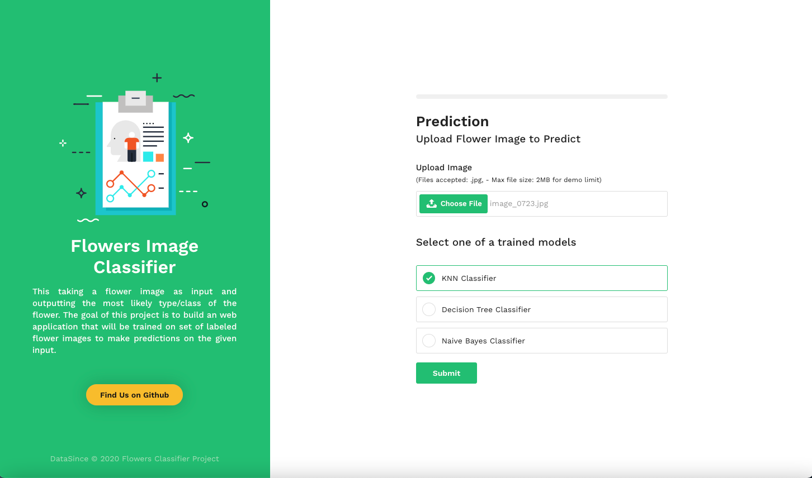

# Flowers Image Classifier


##  Introduction

Flower classification is a pretty common task and it consists in taking a flower image as input and outputting the most likely type/class of the flower. The goal of this project is to build an web application that will be trained on set of labeled flower images to make predictions on the given input.

##  Features

1. Create Pandas DataFrame from row data and save it in CSV file
2. Use HOG: Histogram of Oriented Gradients as feature extraction algorithm
3. Split the dataset into Training set and Test set with ratios 75% and 25% respectively
4. Build and train a classifier models (kNN, Naïve Bayes and  Decision Tree) based on the Training set (pandas’ DataFrame). Then save these models as Pickle to load it later on the deployment.
5.  Deploy the models as REST API using Python FLASK.

##  DEMO




## Install Requirements

```
    pip3 install -r requirements.txt
    
```

## Generate CSV Dataset

```
    python create_dataset.py
```

## Train Models

```
    python dataset_preprocessing.py
```

## Run Web Application

```
    python app.py
```

## API

| EndPoint        | Method           | Prams  
| ------------- |:-------------:|:--------------------------------|
| /predictions  |    [POST]     |  file: file, model: (knn, dt, nb)  |


## License

Licensed under the [MIT license](https://opensource.org/licenses/mit-license.php).